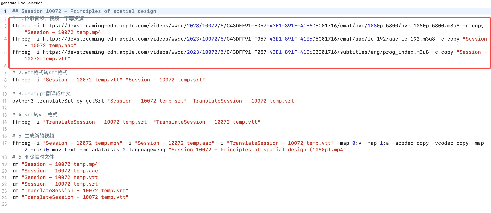
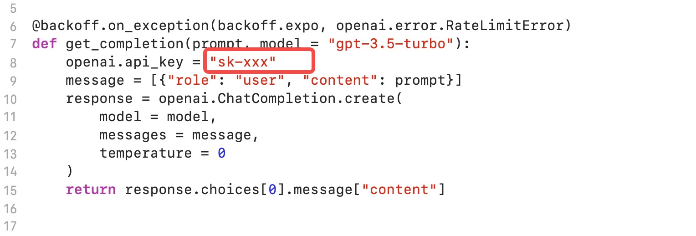

# WWDC-Chinesesubtitles
基于FFmpeg和Chatgpt给WWDC视频生成中文字幕
## 效果预览
添加中文字幕的效果

## 如何使用
#### 1.安装依赖项

```
brew install ffmpeg
pip install openai
pip install pysrt
pip install backoff
pip install fire
```

#### 2.替换generate.sh脚本的资源URL

#### 3.替换translateSrt.py脚本里的OpenAI的apikey
