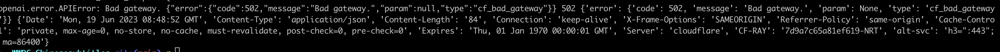

# WWDC-Chinesesubtitles
基于FFmpeg和Chatgpt给WWDC视频生成中文字幕
## 效果预览
添加中文字幕的效果

## 如何使用
#### 1.安装依赖项

```
brew install ffmpeg
pip install openai
pip install pysrt
pip install backoff
pip install fire
pip install requests
pip install bs4
```

#### 2.运行以下脚本,参数1是WWDCURL，参数2是OpenAI的apikey

```
python3 generate.py https://developer.apple.com/wwdc23/xxxx "sk-xxx”
```

## 注意事项
##### 1.因为下载和翻译需要依赖网络，耗时偏长点，请耐心等待
##### 2.如果遇到以下问题，请重试脚本
  
原因：网络异常导致openai的接口失败